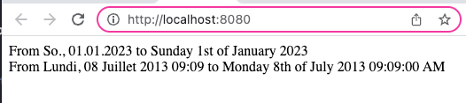

# International Date Formatter Helper
By [Amburi Roy](https://www.linkedin.com/in/amburi/)

`IntlDateFormatterHelper` is a PHP class to parse and change the format of dates of different regions or locales. This helper would help deal with dates in various regions/languages/locales simultaneously.

## Technology used
PHP@7.4
```
❯ php -v              
PHP 7.4.33 (cli) (built: Nov  6 2022 15:12:45) ( NTS )
Copyright (c) The PHP Group
Zend Engine v3.4.0, Copyright (c) Zend Technologies
    with Zend OPcache v7.4.33, Copyright (c), by Zend Technologies
```

This is written using simple PHP functions, so it's effortless to integrate into various PHP frameworks.

## How to use

Parse and convert dates for different locales/regions

#### Convert dates from German to English
The first challenge is to convert the date written in German into English. The date in German is 'So., 01.01.2023', and convert it to English 'Sunday 1st of January 2023'

```php
$date = 'So., 01.01.2023';
$locale = Locales::DE_LOCALE;
$inputDateFormat = 'EEEEEE., d.m.y';
$outputDateFormat = 'l jS \of F Y';
```

#### Convert dates from French to English
Here, convert the date from French into English. The date in French is 'Lundi, 08 Juillet 2013 09:09', and convert it to English 'Monday 8th of July 2013 09:09:00 AM'.

```php
$date = 'Lundi, 08 Juillet 2013 09:09';
$locale = Locales::FR_LOCALE;
$inputDateFormat = 'EEEE, dd MMMM y hh:mm';
$outputDateFormat = 'l jS \of F Y h:i:s A';
```

#### Execute

Here's the code to convert dates for different locales/regions
```php
$intlDateFormat = new IntlDateFormatterHelper($locale);
$enDate = $intlDateFormat->formatStrToStr($date, $inputDateFormat, $outputDateFormat);
echo 'From '. $date .' to '. $enDate . "<br />";
```

To see the output, run this PHP command
```
~/international-date-format
❯ php -S localhost:8080 -t .                                       
[Fri Dec 30 01:41:07 2022] PHP 7.4.33 Development Server (http://localhost:8080) started
```

Finally, here's the output



The helper also contains the `parseTimestamp()` and `parseDate()` methods. Use those methods according to your needs. You can add other locales to the `Locales` interface and extend it to use.


